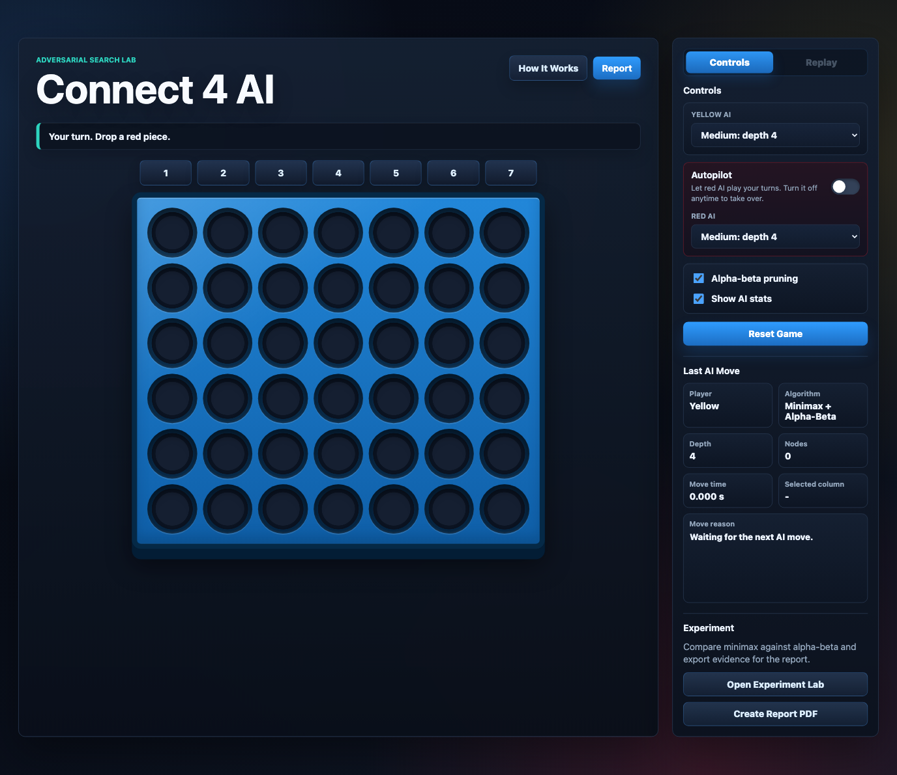

# Connect 4 AI

[](LICENSE)

A local browser-based Connect 4 game with a depth-limited minimax opponent, alpha-beta pruning, heuristic evaluation, AI move explanations, replay controls, optional sound effects, and headless validation.

Difficulty settings run from Easy depth 2 through Good Luck depth 8. Good Luck is the strongest practical browser setting in this project, not a mathematically solved Connect 4 oracle.



## Run the Game

Open `index.html` in a browser. No server or package install is required for gameplay.
After a game ends, the side panel's Replay tab lets you scrub through every move, step backward or forward one move at a time, or play the whole game back at a selected speed. AI moves include the reason, depth, algorithm, nodes searched, score, and move time.
Replay can animate each forward move dropping into the board, and the Replay tab includes a toggle to turn those animations off.
Sound effects are generated in the browser, so no extra audio files are needed, and the Controls panel includes a sound toggle.
Use the How It Works button for an in-app walkthrough of the board model, rules, minimax search, pruning, heuristic, and validation flow. Each walkthrough card includes an expandable code snippet for the relevant functions.

## Report

Open `report.html` for a short technical write-up. Use the Create PDF button to save a PDF through the browser print dialog.

## Optional Headless Validation

If Node.js is available, run:

```bash
node checks/headless-test.js
```

The headless runner checks Connect 4 rules, invalid and full-column rejection, move ordering, win/draw detection, red minimizer behavior, depth-adjusted terminal scoring, alpha-beta consistency, tie variation, and uneven-depth AI matchups.

Additional CLI evidence exports:

```bash
node game/connect4-game-controller.js --headless --red-depth=2 --yellow-depth=6 --games=6 --format=summary
node game/connect4-game-controller.js --experiment --board=midgame --max-depth=6 --format=csv --out=experiment.csv
node game/connect4-game-controller.js --help
```

## Folder Guide

- `index.html` - local browser game
- `report.html` - technical HTML report
- `style/` - dark responsive styling shared by the game and report
- `game/` - Connect 4 rules, minimax search, alpha-beta pruning, board display, replay, Experiment Lab, and command-line exports
- `checks/` - optional Node-based validation runner
- `assets/` - README preview image

The main game modules are separated by responsibility: `connect4-engine.js` handles rules and search, `connect4-board-ui.js` draws the board, `connect4-game-controller.js` coordinates live play, `connect4-replay-ui.js` handles replay, `connect4-sound.js` creates browser sound effects, `connect4-experiment.js` builds evidence, `connect4-experiment-ui.js` renders the lab, and `connect4-cli.js` powers headless commands.

## License

This project is open source under the [MIT License](LICENSE).

## Generated Support Assets

Generated PDFs, screenshots, videos, and packaged archives are intentionally ignored by Git so the repository stays focused on the runnable source.
